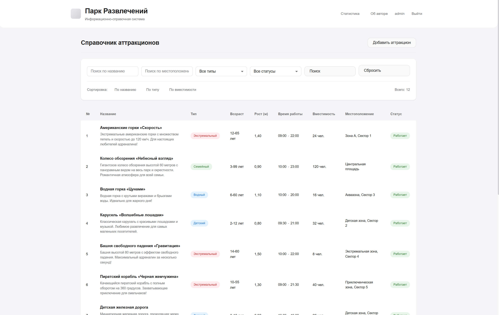
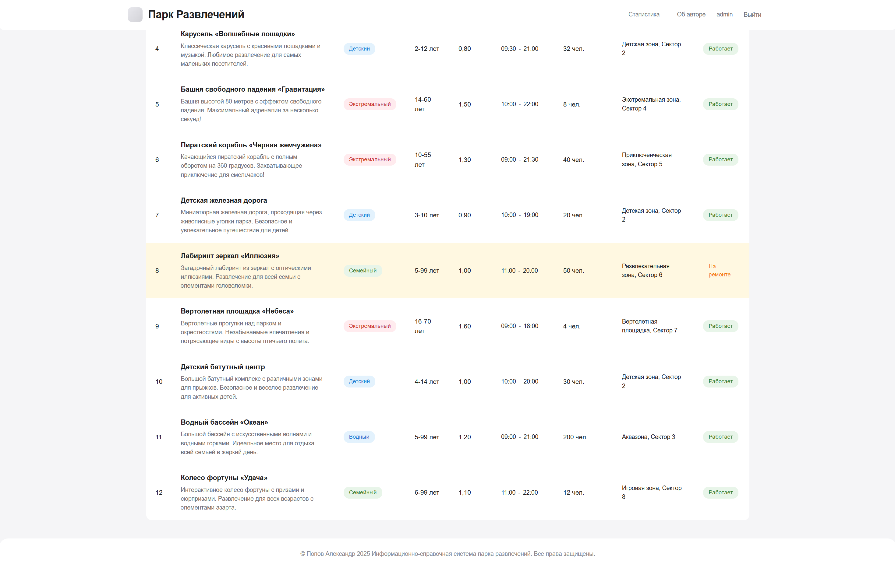
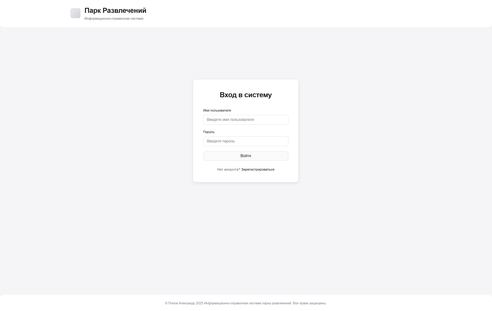
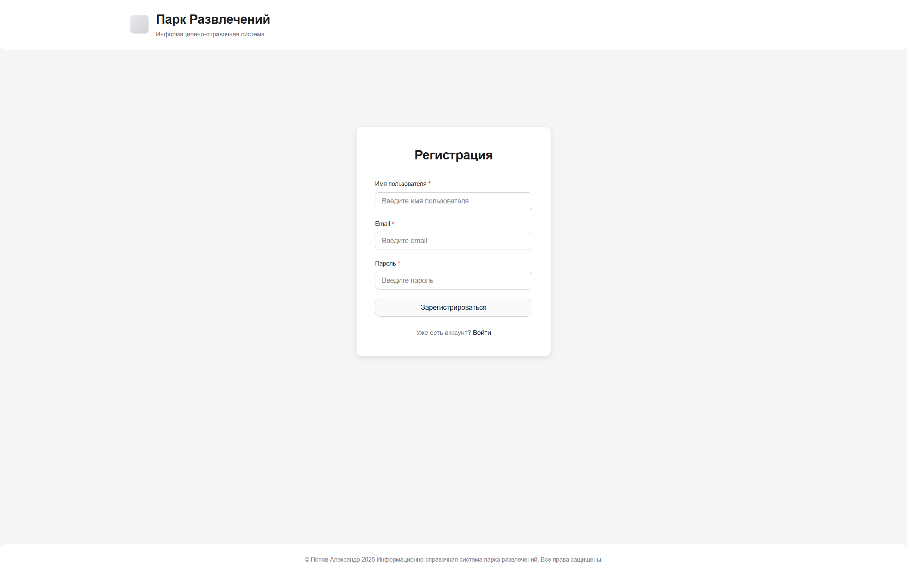
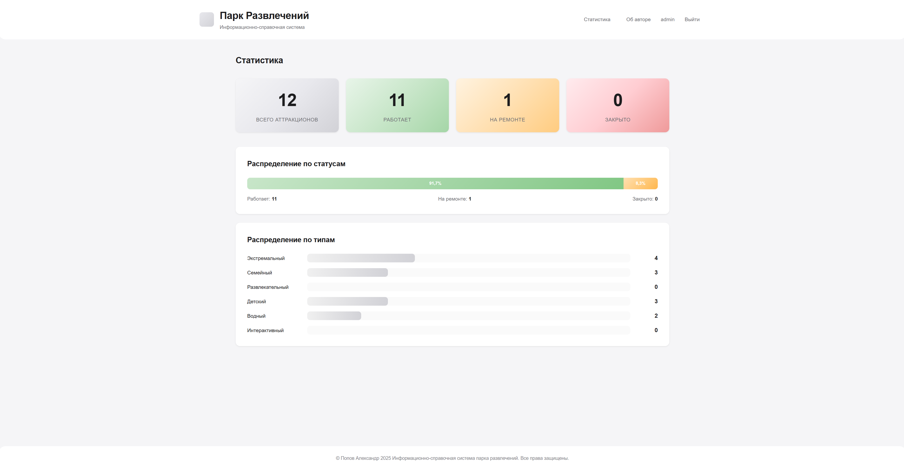
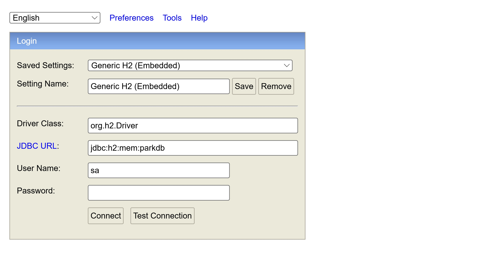
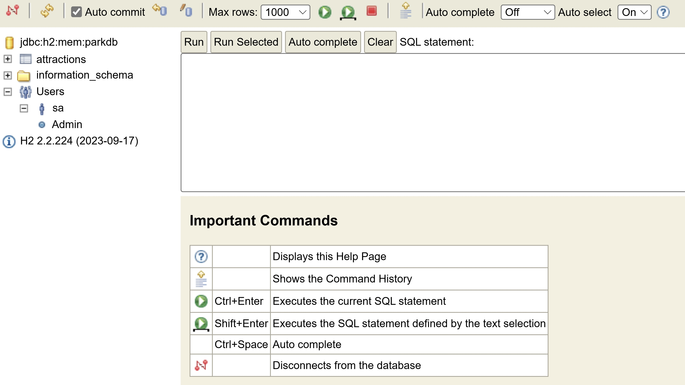

# Информационно-справочная система парка развлечений

Веб-приложение на Spring Boot для управления информацией об аттракционах парка развлечений

## Скриншоты

### Справочник аттракционов (часть 1)


### Справочник аттракционов (часть 2)


### Страница входа


### Страница регистрации


### Статистика


### H2 Console - Экран входа


### H2 Console - Интерфейс


## Требования

- **Java 17 или выше** (единственное требование!)
- Maven не требуется - используется Maven Wrapper (включен в проект)

> **Важно:** После `git clone` всё будет работать сразу! Maven Wrapper автоматически скачает Maven при первом запуске.

## Установка и запуск

### Windows

1. **Установите Java 17** (если не установлена):
   ```cmd
   winget install -e --id Microsoft.OpenJDK.17
   ```
   Или скачайте с [adoptium.net](https://adoptium.net/)

2. **Запустите приложение:**
   ```cmd
   run.bat
   ```
   
   Скрипт автоматически:
   - Найдет установленную Java
   - Использует Maven Wrapper (не требует установки Maven)
   - Запустит приложение

   **Альтернативный способ:**
   ```cmd
   mvnw.cmd spring-boot:run
   ```

### Linux/Mac

1. **Установите Java 17**

2. **Запустите приложение:**
   ```bash
   ./mvnw spring-boot:run
   ```
   
   Или используйте скрипт (если есть):
   ```bash
   ./run.sh
   ```

## Доступ к приложению

После запуска приложение будет доступно по адресу:
- **http://localhost:8080/attractions**

H2 Console (для разработки):
- **http://localhost:8080/h2-console**
- JDBC URL: `jdbc:h2:mem:parkdb`
- Username: `sa`
- Password: (оставьте пустым)

## Функциональность

- Просмотр всех аттракционов
- Добавление нового аттракциона
- Редактирование (клик на строку в таблице)
- Удаление (кнопка в форме редактирования)
- Валидация данных
